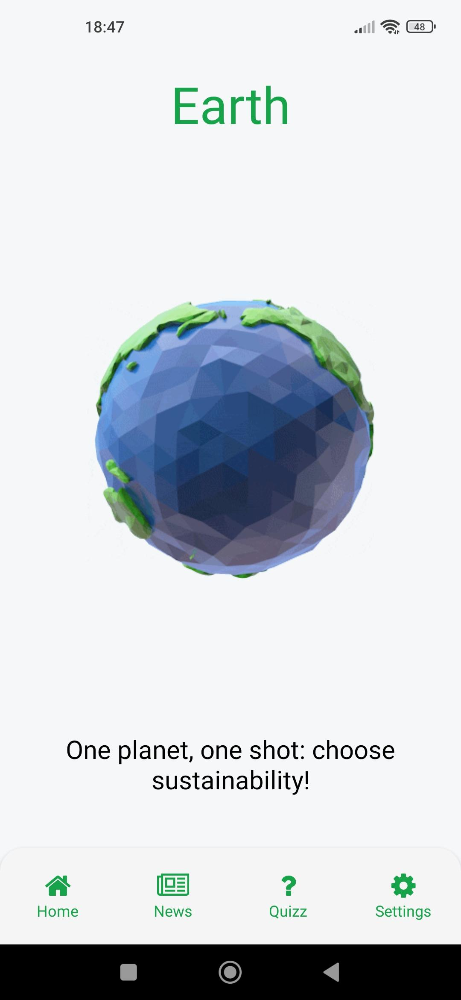

<h1 align="center">
     🌍 <a href="" alt="React URL">Earth: Sustainability App</a>
</h1>

<p align="center">
  

  
  
  
  
  
   
   <a href="https://github.com/ovasconceloss/sustainability-app/stargazers">
    
  </a> 
</p>

<hr>

<div align="center">
    
    
</div>

<hr>

## 💻 About

Earth is a mobile app developed as part of a school project in English class. The main goal of this app is to raise people's awareness about sustainability and promote this cause in an engaging way.

Earth offers a variety of content, including updated news and interactive quizzes, to educate users about sustainable practices and encourage them to adopt eco-friendly behaviors.

## 🚀 Get Started

### Prerequisites

Before you begin, you will need to have the following tools installed on your machine: [Git](https://git-scm.com) and [Node.js](https://nodejs.org/en/). 

#### 🧭 Running Application

```bash

# Clone this repository
$ git clone https://github.com/OVasconceloss/sustainability-app.git

# Access the project folder in your terminal/cmd
$ cd sustainability-app

# Install the dependencies
$ npm install

# Run the application in development mode
$ npx expo start

```

---

## 🛠 Technologies

#### **Mobile**  ([React Native](https://reactnative.dev/))

> See the file [package.json](./package.json)

#### [](https://github.com/tgmarinho/Ecoleta#utilit%C3%A1rios)**Utilities**

-   Icons: **[Font Awesome](https://fontawesome.com/)**
-   Editor:  **[Visual Studio Code](https://code.visualstudio.com/)**
-   Commit Conventional:  **[Conventional Commits](https://www.conventionalcommits.org/en/v1.0.0/)**


---
## 💪 How to Contribute

1. Make a **fork** of the project.
2. Create a new branch with your changes: `git checkout -b my-feature`
3. Save the changes and create a commit message: `git commit -m "feature: My new feature"`
4. Send your changes: `git push origin my-feature`

---

## 📝 License

This project is under license [MIT](./LICENSE).

---